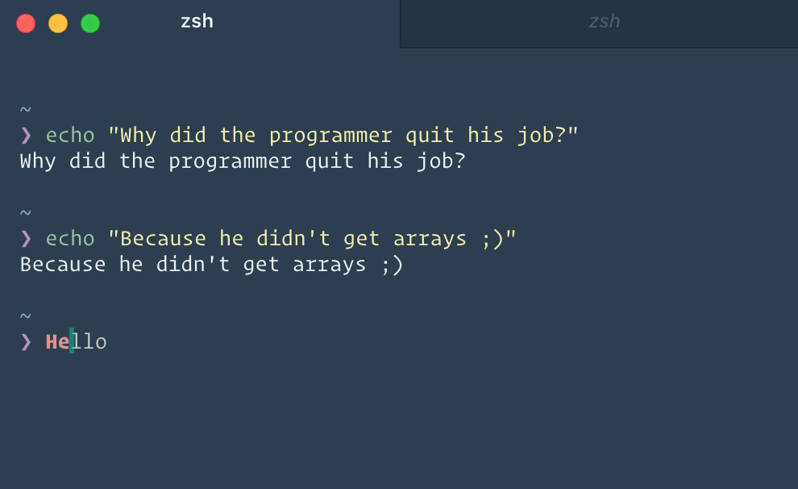

# :neckbeard: hyperterm-hipster :bowtie:

> Hipster [HyperTerm](https://hyperterm.org) theme

A **hipster** theme based on the [hipster-syntax](https://github.com/Agnostics/hipster-syntax) theme for Atom by [Agnostics](https://github.com/Agnostics).

  

## Install
Add `hyperterm-hipster` to the plugins list in your `~/.hyperterm.js` config file.

## Tip
To get the exact same look as in the screenshot, you need to use the [Pure](https://github.com/sindresorhus/pure) prompt, [zsh-syntax-highlighting](https://github.com/zsh-users/zsh-syntax-highlighting) plugin, [zsh-autosuggestions](https://github.com/zsh-users/zsh-autosuggestions) plugin and [Operator Mono](http://www.typography.com/blog/introducing-operator) font.

## License
Created with ♥ by [Tiaan du Plessis](https://github.com/mightyCrow). Licensed under the MIT License.
